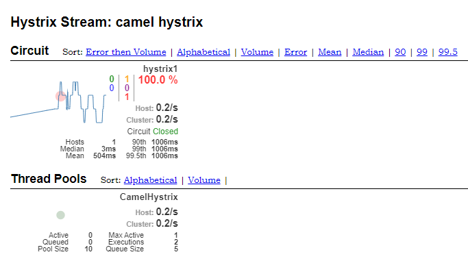

Logging and Circuit Breaker Mechanism with Hystrix, on Red Hat Fuse
===================

Tools
-------------------
* Programming Language - Java
* Library - Red Hat Fuse 7.2

Concept 
-------------------
An example on doing a logging mechanism with JBoss Fuse, or its opensource version which is Apache Camel. 

Im using slf4j and configure a debug level on `application.properties` file to capture all http inbound-outbound body request. Without have to change existing camel xml files.

The interesting part is actually on how to do a fast-failover and circuit breaker mechanism with hystrix, and monitor all the statistics thru hystrix dashboard.



How to Run
------------------

```
mvn spring-boot:run -s settings.xml
```

Blog Post
------------------
```
https://edwin.baculsoft.com/2020/07/logging-and-circuit-breaker-mechanism-with-hystrix-on-red-hat-fuse/
```

Reference 
-------------------
```
https://access.redhat.com/documentation/en-us/red_hat_fuse/7.6/html/apache_camel_component_reference/hystrix_component
```

```
https://access.redhat.com/documentation/en-us/red_hat_fuse/7.6/html/apache_camel_development_guide/msgrout#MsgRout-Hystrix
```
